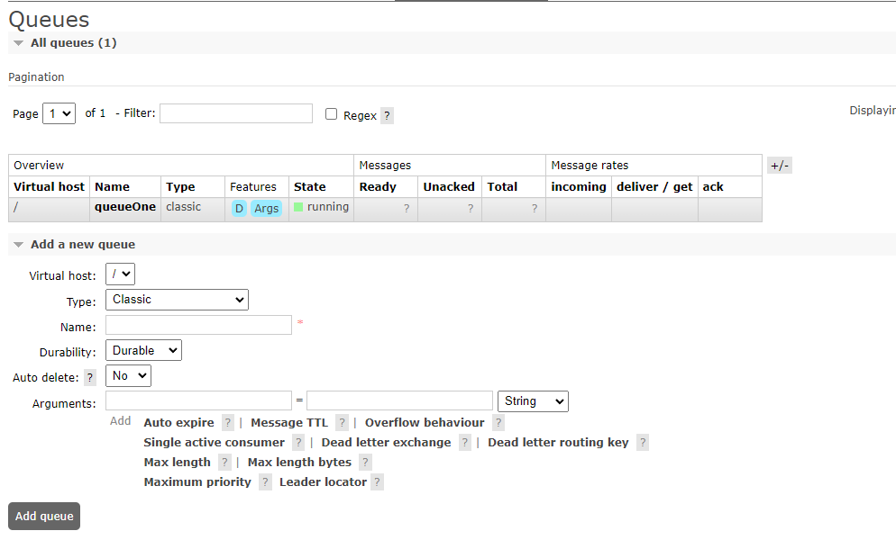
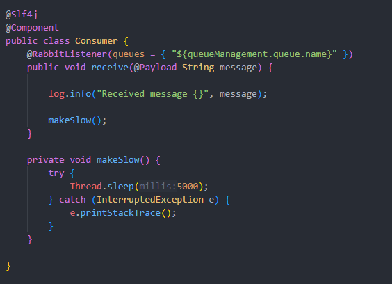
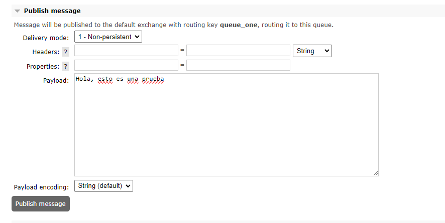
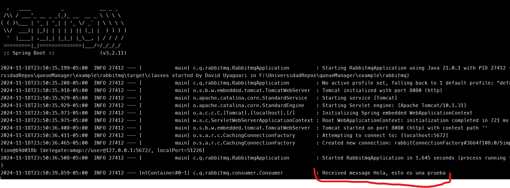

# RabbitMQ se compone por un productor y un consumidor

# Gestores de colas usando RabbitMQ en springBoot

1. Es importante tener docker-compose.yaml con la imagen de RabbitMQ
2. Ejecutamos con el comando "docker-compose up -d"
3. Una vez que se haya creado exitosamente la imagen ingresamos desde el navegador a localhost:15672
4.Nos loggeamos con las credenciales definidas en nuestro docker compose

# Creamos nuestro proyecto con springboot para ello se puede utilizar [Spring](https://start.spring.io/)

1. Modificamos el application.properties y agregamos la informacion necesaria para que el proyecto funcione.
2. Creamos una clase Consumer que va a ser el consumidor

# Agregamos una cola desde nuestro cliente de RabbitMQ

# Agregamos la clase "Consumer"

Esta clase nos va a permitir a travez de las notaciones escuchar los mensajes de la cola
para posteriormente por motivos de prueba mostrarlos en consola.

# Probar enviando desde el cliente de RabbitMQ el mensaje

Comprobamos en la consola

