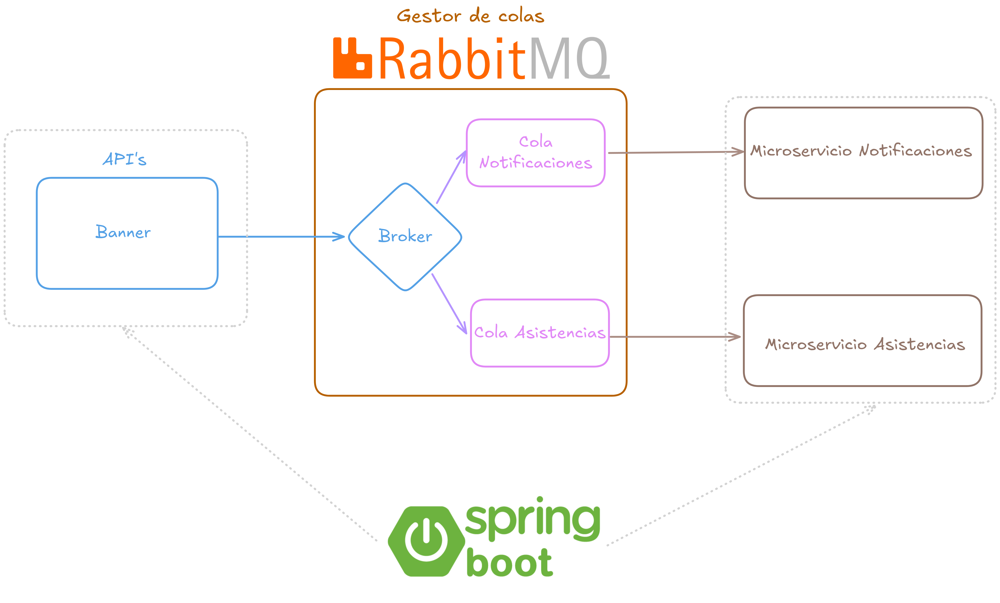

# Caso de estudio

**Diseño y Arquitectura de Software** 
**Quito, Ecuador** 

## Objetivo
Utilizar un gestor de colas, crear una cola que reciba un "mensaje" y distribuir a dos microservicios utilizando dos diferentes tipos de exchanges.

## Caso de estudio:

El microservicio Banner es el encargado de gestionar la asistencia de los estudiantes y tambien la aprovación de la justificación de faltas.
- Registro de Asistencia: cada vez que se consuma exitosamenete la API desde Banner, se debe gestionar ese registro en otro microservicio llamado Attendances.

- Justificación de faltas: cada vez que se consuma exitosamenete la API desde Banner, se debe gestionar ese registro a dos microservicios, 
el uno encargado de registrar la perisistencia de la justificación y el segundo el encargado de notificar por los diferentes medios el registro exitoso.

### Arquitectura de la solución

- Se tienen 3 microservicios, Banner, Notifications, Attendances
-Cada uno se encarga de lo descrito anteriormente.

### Como funcionan los exchanges

- Al consultar a la primera API /attendance/justify se genera un mensaje tipo Fanout lo que quiere decir que envía el mensaje a todas las colas vinculadas a ese exchange,
por lo tanto se enviarán a ambos microservicios ya que es necesario notificar y gestionar la persistencia de la justificación de la inasistencia.

- Al consultar a la segunda API /attendance/register se genera un mensaje tipo Topic lo que quiere decir que envía el mensaje solo a los que tengan como paramentro share.*.attendance,
por lo tanto se enviarán solo al microservicio Attendances ya que el routing key configurado es share.register.attendance.
* Cuando se configura  share.*.attendance estamos indicando que no importa lo que lleve en medio siempre que el routing key coincida de esta forma: share.(cualquier valor).attendance.

- Al recibir los mensajes en cada microservicio se procesarán siguiendo la lógica de negocio de cada microservicio.